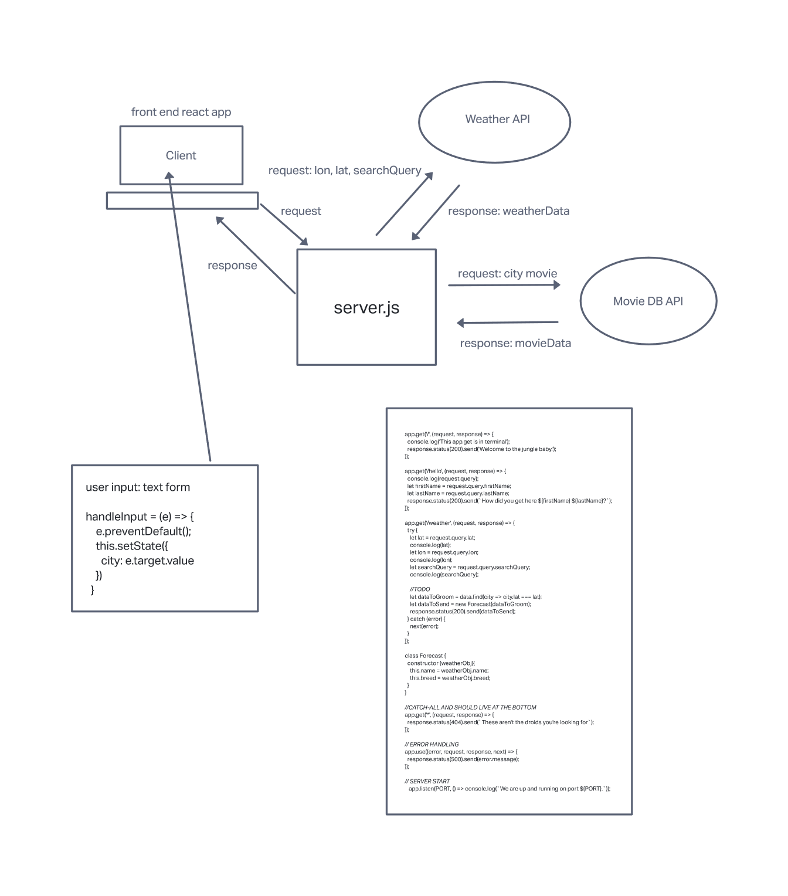

# Project Name

**Author**: Jordan Kwan
**Version**: 1.2.0

## Overview

Providing an application to locate the latitude and longitudes of specific locations. Useful information for many different parties who interact with it Providing a map image. Populates Movies and Forecast for the location provided by the user.

## Getting Started

1. Set up Repo on GitHub.
2. Set up React app.
3. Create an API token for selected API of choice.
4. Test and Deploy React app.
5. Utilise documentation for getting the longitude and latitude of location with a form `lat`,`lon`, and `display_name`.
6. Use the correct link for the map image.
7. Rely on API for weather Forecast and Movie API keys.
8. Populate movies for city input and Forecast as well.
9. Add an error for when applicable.

## Architecture

Created using React, bootstrap, API, Axios, locationIQ, and maps. Used a form to get the necessary data to utilize both the maps and locationiq's database for the longitude and latitude as well as an image of the inquired location. Displayed an error when applicable and an image as well as the city name, long and lat.

## Change Log

10-24-2022 Initial creation
10-28-2022 Weather API
10-20-2022 Movie API and Heroku

## Credit and Collaborations

Nicholas Seidel and Nerissa Leynes, Jonathan Staib

Name of feature: long, lat, and maps

Estimate of time needed to complete: 3hrs

Start time: 2pm

Finish time: 8pm

Actual time needed to complete: 6hrs

Name of feature: forecast from server

Estimate of time needed to complete: 5hrs

Start time: 2pm

Finish time: 8pm

Actual time needed to complete: 2 days

Name of feature: Movie and Heroku deployment

Estimate of time needed to complete: 5hrs

Start time: 4pm

Finish time: 10pm

Actual time needed to complete: 6 hrs
